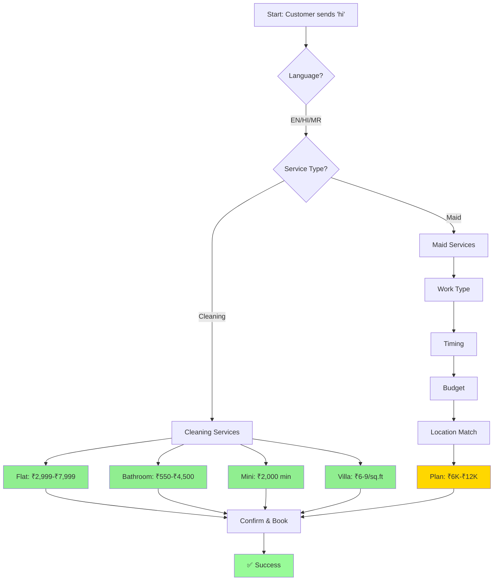
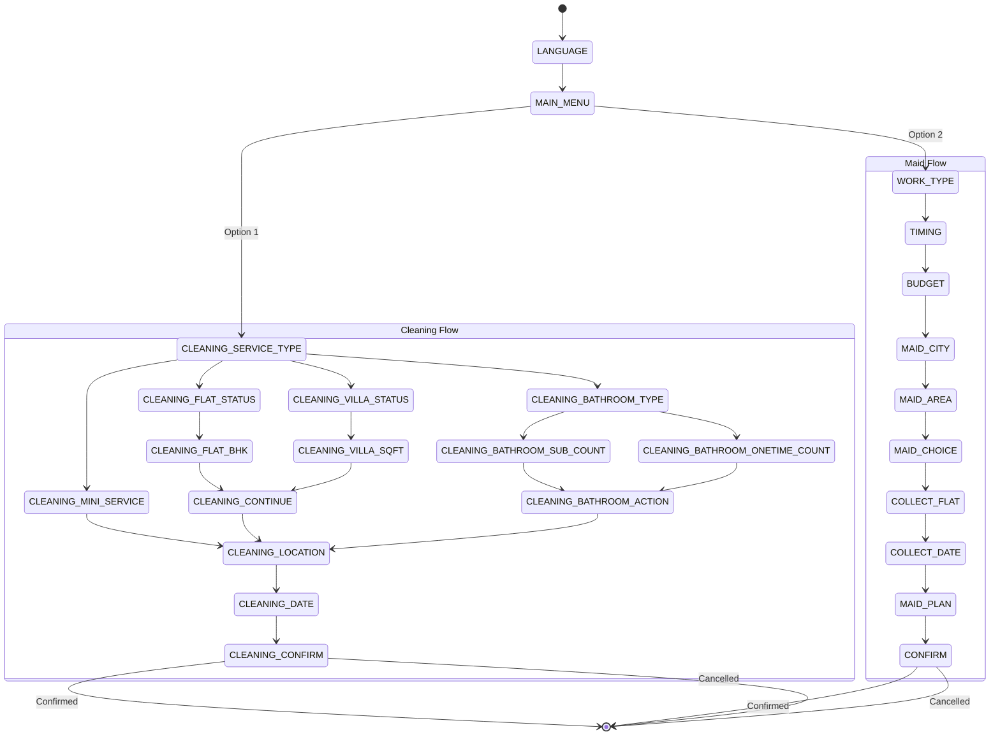

# CLEANLY Services - Complete Flow Diagram

## How to View These Diagrams

### Option 1: VS Code (Recommended)
1. Install extension: "Markdown Preview Mermaid Support"
2. Open this file and press `Ctrl+Shift+V` (or `Cmd+Shift+V` on Mac)
3. Scroll to see all diagrams

### Option 2: Online Viewer
1. Go to [mermaid.live](https://mermaid.live)
2. Copy the content from `.mmd` files in this folder:
   - `flowchart-main.mmd` - Complete detailed flow
   - `flowchart-simple.mmd` - Simplified overview
   - `flowchart-states.mmd` - State machine diagram
3. Paste into the editor and view/export

### Option 3: Direct Files
Open the `.mmd` files directly with a Mermaid viewer or paste into mermaid.live

---

## Main Flow with Pricing Details

```mermaid
flowchart TD
    Start([Customer sends 'hi']) --> Language{Select Language}
    Language -->|1| LangEN[English]
    Language -->|2| LangHI[हिंदी]
    Language -->|3| LangMR[मराठी]
    
    LangEN --> MainMenu{Main Menu<br/>Choose Service}
    LangHI --> MainMenu
    LangMR --> MainMenu
    
    MainMenu -->|1| CleaningFlow[HOME Deep Cleaning]
    MainMenu -->|2| MaidFlow[MONTHLY Maid Service]
    
    %% ============================================
    %% CLEANING SERVICE FLOW
    %% ============================================
    
    CleaningFlow --> CleaningType{Select Service Type}
    
    CleaningType -->|1| FlatDeep[Flat Deep Cleaning]
    CleaningType -->|2| Bathroom[Bathroom Cleaning]
    CleaningType -->|3| MiniService[Mini Service Package]
    CleaningType -->|4| Villa[Villa/Bungalow/Row House]
    
    %% --- FLAT DEEP CLEANING ---
    FlatDeep --> FlatStatus{Flat Status}
    FlatStatus -->|1| Furnished[Furnished]
    FlatStatus -->|2| Empty[Empty/Vacant]
    FlatStatus -->|3| PostInterior[Post Interior Cleaning]
    
    Furnished --> FurnishedSub{Condition}
    FurnishedSub -->|1| FurnRegular[Regular Occupied House]
    FurnishedSub -->|2| FurnMoveOut[Move Out Cleaning]
    FurnishedSub -->|3| FurnPossession[New Flat Possession]
    
    Empty --> EmptySub{Condition}
    EmptySub -->|1| EmptyMoveOut[Move Out Cleaning]
    EmptySub -->|2| EmptyPossession[New Flat Possession]
    
    FurnRegular --> FlatBHK
    FurnMoveOut --> FlatBHK
    FurnPossession --> FlatBHK
    EmptyMoveOut --> FlatBHK
    EmptyPossession --> FlatBHK
    PostInterior --> FlatBHK
    
    FlatBHK{Select BHK}
    FlatBHK -->|1| Furn1BHK["1 BHK<br/>Furnished: ₹3,199<br/>Empty: ₹2,999<br/>Post-Interior: ₹5,999"]
    FlatBHK -->|2| Furn2BHK["2 BHK<br/>Furnished: ₹3,599<br/>Empty: ₹3,499<br/>Post-Interior: ₹6,999"]
    FlatBHK -->|3| Furn3BHK["3 BHK<br/>Furnished: ₹4,799<br/>Empty: ₹4,499<br/>Post-Interior: ₹7,999"]
    FlatBHK -->|4| Furn4BHK["4 BHK/Villa<br/>Inspection Required"]
    
    Furn1BHK --> AddOns{Add-ons?}
    Furn2BHK --> AddOns
    Furn3BHK --> AddOns
    Furn4BHK --> AddOns
    
    AddOns -->|1 Continue| CleanLocation
    AddOns -->|Type add-ons| AddOnsList["Kitchen: ₹450<br/>Sofa: ₹150/seat"]
    AddOnsList --> CleanLocation
    
    %% --- VILLA CLEANING ---
    Villa --> VillaStatus{Villa Condition}
    VillaStatus -->|1| VillaRegular["Regular Occupied<br/>Rate: ₹6/sq.ft"]
    VillaStatus -->|2| VillaReno["Post Interior/Renovation<br/>Rate: ₹9/sq.ft"]
    
    VillaRegular --> VillaSqft[Enter Square Feet]
    VillaReno --> VillaSqft
    VillaSqft --> VillaPrice["Calculate:<br/>Sq.Ft × Rate = Total"]
    VillaPrice --> VillaContinue{Continue?}
    VillaContinue -->|1| CleanLocation
    
    %% --- BATHROOM CLEANING ---
    Bathroom --> BathType{Bathroom Type}
    BathType -->|1| BathSub[Subscription Plan]
    BathType -->|2| BathOneTime[One-Time Cleaning]
    
    BathSub --> BathSubCount{How many bathrooms?}
    BathSubCount -->|1| Bath2Sub["2 Bathrooms<br/>₹2,250/month<br/>3-month plan<br/>1 visit/month"]
    BathSubCount -->|2| Bath3Sub["3 Bathrooms<br/>₹3,375/month<br/>3-month plan<br/>1 visit/month"]
    BathSubCount -->|3| Bath4Sub["4 Bathrooms<br/>₹4,500/month<br/>3-month plan<br/>1 visit/month"]
    
    Bath2Sub --> BathAction
    Bath3Sub --> BathAction
    Bath4Sub --> BathAction
    
    BathOneTime --> BathOneCount{How many bathrooms?}
    BathOneCount -->|1| Bath1One["1 Bathroom<br/>₹550"]
    BathOneCount -->|2| Bath2One["2 Bathrooms<br/>₹1,100"]
    BathOneCount -->|3| Bath3One["3 Bathrooms<br/>₹1,650"]
    BathOneCount -->|4| Bath4One["4+ Bathrooms<br/>₹2,200"]
    
    Bath1One --> BathAction
    Bath2One --> BathAction
    Bath3One --> BathAction
    Bath4One --> BathAction
    
    BathAction{Action}
    BathAction -->|1 Continue| CleanLocation
    BathAction -->|2 Support| Support
    
    %% --- MINI SERVICE ---
    MiniService --> MiniList["Mini Services Menu:<br/>Kitchen Deep Clean: ₹2,400<br/>Kitchen Clean: ₹1,500<br/>Single Fridge: ₹300<br/>Double Fridge: ₹400<br/>Chimney: ₹400<br/>Bathroom: ₹550<br/>Ceiling Fan: ₹50<br/>Wall Wiping: ₹500/room<br/>Window: ₹300<br/>Sofa: ₹150/seat<br/>Balcony: ₹400-650<br/>Carpet: ₹500-750<br/>Mattress: ₹400-700<br/>⚠️ Min Order: ₹2,000"]
    MiniList --> MiniInput[Type services needed]
    MiniInput --> CleanLocation
    
    %% --- CLEANING COMMON FLOW ---
    CleanLocation[Enter Location/Society]
    CleanLocation --> CleanDate{Preferred Date}
    CleanDate -->|1| DateToday[Today]
    CleanDate -->|2| DateTomorrow[Tomorrow]
    CleanDate -->|3| DateCustom[Enter Custom Date]
    
    DateToday --> CleanConfirm
    DateTomorrow --> CleanConfirm
    DateCustom --> CleanConfirm
    
    CleanConfirm{Confirm Booking?}
    CleanConfirm -->|1 Confirm| CleanSuccess["✅ Booking Confirmed!<br/>Team will call shortly<br/>Saved to Google Sheets<br/>Admin notified"]
    CleanConfirm -->|2 Cancel| Cancel
    
    %% ============================================
    %% MAID SERVICE FLOW
    %% ============================================
    
    MaidFlow --> WorkType{Work Type}
    WorkType -->|1| WorkCooking[Cooking]
    WorkType -->|2| WorkCleaning[Cleaning]
    WorkType -->|3| WorkBabysitter[Babysitter]
    WorkType -->|4| WorkCaretaker[Caretaker]
    WorkType -->|5| WorkCustom[Custom - Type your need]
    
    WorkCooking --> Timing
    WorkCleaning --> Timing
    WorkBabysitter --> Timing
    WorkCaretaker --> Timing
    WorkCustom --> Timing
    
    Timing{Timing Preference}
    Timing -->|1| TimePT["Part Time<br/>1-3 hrs"]
    Timing -->|2| TimeFT8["Full Time<br/>8 hrs"]
    Timing -->|3| TimeFT10["Full Time<br/>10 hrs"]
    Timing -->|4| TimeFT24["Full Time<br/>24 hrs"]
    
    TimePT --> Budget
    TimeFT8 --> Budget
    TimeFT10 --> Budget
    TimeFT24 --> Budget
    
    Budget{Monthly Budget}
    Budget -->|1| BudgetSkill["Based on skill<br/>& experience"]
    Budget -->|2| Budget4to6["₹4,000 - ₹6,000"]
    Budget -->|3| Budget6to10["₹6,000 - ₹10,000"]
    Budget -->|4| Budget10to20["₹10,000 - ₹20,000"]
    Budget -->|5| Budget20to30["₹20,000 - ₹30,000"]
    
    BudgetSkill --> MaidCity
    Budget4to6 --> MaidCity
    Budget6to10 --> MaidCity
    Budget10to20 --> MaidCity
    Budget20to30 --> MaidCity
    
    MaidCity{Select City}
    MaidCity -->|1| CityPune["Pune<br/>19 areas available"]
    MaidCity -->|2| CityPCMC["PCMC<br/>8 areas available"]
    
    CityPune --> PuneAreas["Pune Areas:<br/>Aundh, Baner, Bavdhan<br/>Dhanori, Hadapsar<br/>Kalyani Nagar, Kharadi<br/>Kondhwa, Koregaon<br/>Kothrud, Lohegaon<br/>Magarpatta, Mundhwa<br/>NIBM, Undri<br/>Viman Nagar, Vishrantwadi<br/>Wadgaon Sheri, Wagholi"]
    CityPCMC --> PCMCAreas["PCMC Areas:<br/>Akurdi, Bhosari<br/>Chinchwad, Hinjewadi<br/>Kotewadi, Nigdi<br/>Pimpri, Wakad"]
    
    PuneAreas --> SelectArea[Select Area Number]
    PCMCAreas --> SelectArea
    
    SelectArea --> MatchingEngine["🔍 Matching Engine<br/>Fetch from Supabase<br/>Calculate distance<br/>Zone categorization"]
    
    MatchingEngine --> ZoneLogic["Zone Logic:<br/>P1 Green: < 1 km<br/>P2 Blue: 1-3 km<br/>P3 Orange: 3-6 km<br/>P4 Red: 6-8 km<br/>Beyond 8km: Excluded"]
    
    ZoneLogic --> TopMaids["Show Top 3 Maids:<br/>ID, Name, Work Type<br/>Experience, Salary<br/>Distance, Zone"]
    
    TopMaids --> MaidChoice[Select Maid by ID]
    MaidChoice --> CollectFlat[Enter Flat/Address]
    CollectFlat --> CollectDate[Enter Start Date]
    CollectDate --> MaidPlan{Select Plan}
    
    MaidPlan -->|1| PlanStandard["Part-Time Standard<br/>₹6,000 one-time<br/>✅ Home interviews<br/>✅ ID verification<br/>✅ Skill screening<br/>✅ 1 free replacement<br/>within 1 month"]
    
    MaidPlan -->|2| PlanPTVerified["Part-Time Verified<br/>₹12,000 one-time<br/>✅ All Standard features<br/>✅ Police verification<br/>✅ 2 free replacements<br/>within 6 months"]
    
    MaidPlan -->|3| PlanFTVerified["Full-Time Verified<br/>1 Month Salary<br/>✅ All Standard features<br/>✅ Police verification<br/>✅ 2 free replacements<br/>within 6 months"]
    
    PlanStandard --> MaidConfirm
    PlanPTVerified --> MaidConfirm
    PlanFTVerified --> MaidConfirm
    
    MaidConfirm{Confirm Booking?}
    MaidConfirm -->|1 Confirm| MaidSuccess["✅ Booking Confirmed!<br/>Saved to Google Sheets<br/>Admin notified<br/>Team will call shortly<br/>💡 Registration: ₹500<br/>adjusted in final fee"]
    MaidConfirm -->|2 Cancel| Cancel
    
    %% ============================================
    %% COMMON ENDPOINTS
    %% ============================================
    
    CleanSuccess --> End([End Session])
    MaidSuccess --> End
    Cancel["❌ Cancelled<br/>Type 'hi' to restart"]
    Cancel --> End
    
    Support["📞 Talk to Support<br/>Call: +91 8767572043"]
    Support --> End
    
    %% Global Option
    MainMenu -.->|0 anytime| Support
    CleaningType -.->|0 anytime| Support
    WorkType -.->|0 anytime| Support
    
    %% Styling
    classDef priceNode fill:#90EE90,stroke:#006400,stroke-width:2px,color:#000
    classDef planNode fill:#FFD700,stroke:#FF8C00,stroke-width:2px,color:#000
    classDef zoneNode fill:#87CEEB,stroke:#4682B4,stroke-width:2px,color:#000
    classDef successNode fill:#98FB98,stroke:#228B22,stroke-width:3px,color:#000
    classDef errorNode fill:#FFB6C1,stroke:#DC143C,stroke-width:2px,color:#000
    
    class Furn1BHK,Furn2BHK,Furn3BHK,Furn4BHK,VillaPrice,Bath2Sub,Bath3Sub,Bath4Sub,Bath1One,Bath2One,Bath3One,Bath4One,MiniList,AddOnsList priceNode
    class PlanStandard,PlanPTVerified,PlanFTVerified planNode
    class ZoneLogic,TopMaids,MatchingEngine zoneNode
    class CleanSuccess,MaidSuccess successNode
    class Cancel,Support errorNode
```

## Simplified Decision Tree

## State Machine Overview

## Pricing Summary Table

### Cleaning Services

| Service | Details | Price |
|---------|---------|-------|
| **Flat Deep Cleaning** | | |
| 1 BHK Furnished | Regular/Move-out/New | ₹3,199 |
| 2 BHK Furnished | Regular/Move-out/New | ₹3,599 |
| 3 BHK Furnished | Regular/Move-out/New | ₹4,799 |
| 1 BHK Empty | Move-out/New | ₹2,999 |
| 2 BHK Empty | Move-out/New | ₹3,499 |
| 3 BHK Empty | Move-out/New | ₹4,499 |
| 1 BHK Post-Interior | | ₹5,999 |
| 2 BHK Post-Interior | | ₹6,999 |
| 3 BHK Post-Interior | | ₹7,999 |
| 4 BHK/Villa | | Inspection Required |
| **Villa/Bungalow** | | |
| Regular Occupied | Per sq.ft | ₹6/sq.ft |
| Post-Renovation | Per sq.ft | ₹9/sq.ft |
| **Bathroom Cleaning** | | |
| 1 Bathroom One-Time | | ₹550 |
| 2 Bathrooms One-Time | | ₹1,100 |
| 3 Bathrooms One-Time | | ₹1,650 |
| 4+ Bathrooms One-Time | | ₹2,200 |
| 2 Bathrooms Subscription | 3 months, 1 visit/month | ₹2,250/month |
| 3 Bathrooms Subscription | 3 months, 1 visit/month | ₹3,375/month |
| 4 Bathrooms Subscription | 3 months, 1 visit/month | ₹4,500/month |
| **Add-ons** | | |
| Kitchen External Cleaning | | ₹450 |
| Sofa Cleaning | Per seat | ₹150 |
| Single Door Fridge | | ₹300 |
| Double Door Fridge | | ₹400 |
| Chimney Deep Clean | | ₹400 |
| Ceiling Fan | Per fan | ₹50 |
| Wall Wet Wiping | Per room | ₹500 |
| Window Cleaning | Per window | ₹300 |
| Balcony < 25 sq.ft | | ₹400 |
| Balcony > 25 sq.ft | | ₹650 |
| Carpet < 30 sq.ft | | ₹500 |
| Carpet 30-100 sq.ft | | ₹750 |
| Single Bed Mattress | | ₹400 |
| Double Bed Mattress | | ₹700 |

### Maid Services

| Plan | Price | Features |
|------|-------|----------|
| **Part-Time Standard** | ₹6,000 (one-time) | Home interviews, ID verification, Skill screening, 1 free replacement (1 month) |
| **Part-Time Verified** | ₹12,000 (one-time) | All Standard + Police verification, 2 free replacements (6 months) |
| **Full-Time Verified** | 1 Month Salary (one-time) | All Standard + Police verification, 2 free replacements (6 months) |
| **Registration Fee** | ₹500 | Adjusted in final service fee |

### Budget Ranges (Customer Selection)

| Range | Monthly Salary |
|-------|----------------|
| Option 1 | Based on skill & experience |
| Option 2 | ₹4,000 - ₹6,000 |
| Option 3 | ₹6,000 - ₹10,000 |
| Option 4 | ₹10,000 - ₹20,000 |
| Option 5 | ₹20,000 - ₹30,000 |

